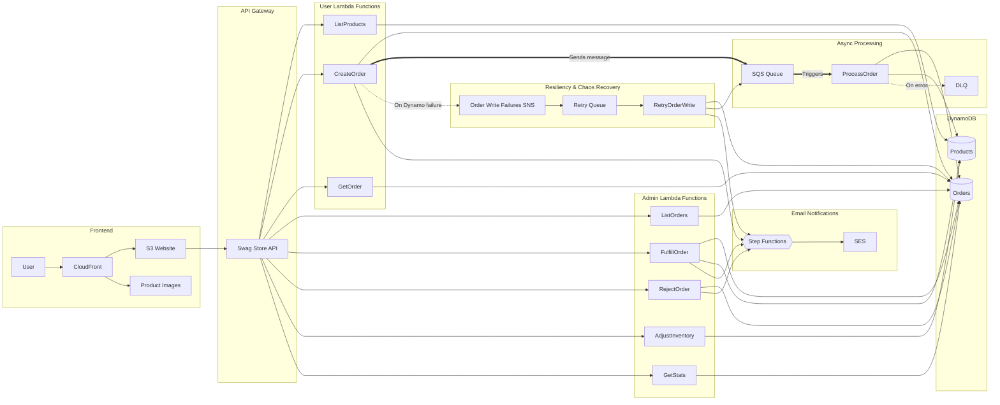

```mermaid
graph LR
    subgraph Frontend
        User[User]
        CF[CloudFront]
        S3Web[S3 Website]
        S3Images[Product Images]
    end

    subgraph API["API Gateway"]
        APIGW[Swag Store API]
    end

    subgraph UserFunctions["User Lambda Functions"]
        ListProducts[ListProducts]
        CreateOrder[CreateOrder]
        GetOrder[GetOrder]
    end
    
    subgraph AdminFunctions["Admin Lambda Functions"]
        ListOrders[ListOrders]
        FulfillOrder[FulfillOrder]
        RejectOrder[RejectOrder]
        AdjustInventory[AdjustInventory]
        GetStats[GetStats]
    end
    
    subgraph AsyncProcessing["Async Processing"]
        OrderQueue[SQS Queue]
        ProcessOrder[ProcessOrder]
        DLQ[DLQ]
    end

    subgraph Resilience["Resiliency & Chaos Recovery"]
        OrderWriteFailures[Order Write Failures SNS]
        OrderWriteFailuresQueue[Retry Queue]
        RetryOrderWrite[RetryOrderWrite]
    end

    subgraph Database["DynamoDB"]
        ProductsDB[("Products")]
        OrdersDB[("Orders")]
    end

    subgraph EmailNotifications["Email Notifications"]
        EmailSFN{{Step Functions}}
        SES[SES]
    end

    %% Frontend Flow
    User --> CF
    CF --> S3Web
    CF --> S3Images
    S3Web --> APIGW

    %% API to Functions
    APIGW --> ListProducts
    APIGW --> CreateOrder
    APIGW --> GetOrder
    APIGW --> ListOrders
    APIGW --> FulfillOrder
    APIGW --> RejectOrder
    APIGW --> AdjustInventory
    APIGW --> GetStats

    %% User Functions to Database
    ListProducts --> ProductsDB
    CreateOrder --> OrdersDB
    GetOrder --> OrdersDB

    %% Admin Functions to Database
    ListOrders --> OrdersDB
    FulfillOrder --> OrdersDB
    FulfillOrder --> ProductsDB
    RejectOrder --> OrdersDB
    AdjustInventory --> ProductsDB
    GetStats --> OrdersDB

    %% Async Processing Flow - THIS IS WHERE SQS IS USED
    CreateOrder ==>|Sends message| OrderQueue
    OrderQueue ==>|Triggers| ProcessOrder
    ProcessOrder --> OrdersDB
    ProcessOrder --> ProductsDB
    ProcessOrder -.->|On error| DLQ

    %% Resiliency Flow
    CreateOrder -.->|On Dynamo failure| OrderWriteFailures
    OrderWriteFailures --> OrderWriteFailuresQueue
    OrderWriteFailuresQueue --> RetryOrderWrite
    RetryOrderWrite --> OrdersDB
    RetryOrderWrite --> OrderQueue
    RetryOrderWrite --> EmailSFN

    %% Email Notifications Flow
    CreateOrder --> EmailSFN
    FulfillOrder --> EmailSFN
    RejectOrder --> EmailSFN
    EmailSFN --> SES
```