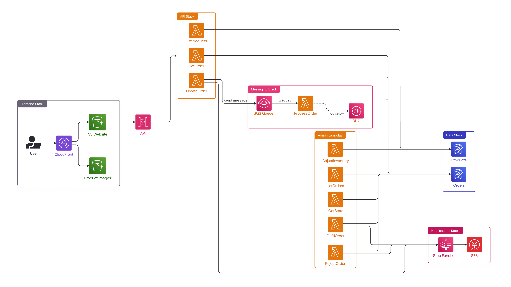

## LocalStack Swag Store

| Key          | Value                                                                                      |
| ------------ | ------------------------------------------------------------------------------------------ |
| Environment  | LocalStack, AWS                                                                            |
| Services     | API Gateway, Lambda, DynamoDB, S3, SQS, Step Functions, SES, CloudFront                   |
| Integrations | AWS CDK, AWS CLI, lstk     |
| Categories   | Serverless, Web, Messaging                                                                 |
| Level        | Intermediate                                                                                |

### Introduction

This sample deploys a serverless swag store using AWS CDK on LocalStack. It provisions the backend (API, queues, tables, workflows), a public image bucket, and a CloudFront‑hosted frontend.



### Prerequisites

- [`lstk` CLI](https://docs.localstack.cloud/aws/developer-tools/running-localstack/lstk/) with `LOCALSTACK_AUTH_TOKEN`
- AWS CLI (required by `lstk aws`)
- CDK with the `lstk cdk` proxy
- Node.js 22 and `make`

### Installation

```bash
git clone https://github.com/localstack-samples/localstack-swag-store.git
cd localstack-swag-store
make install
```

### Deployment

Start LocalStack and deploy stacks:

```bash
export LOCALSTACK_AUTH_TOKEN=<your-auth-token>
lstk start
make build
make bootstrap
make deploy           # deploy backend (SwagStoreMainStack)
make deploy-frontend  # deploy frontend (SwagStoreFrontendStack)
```

Expected outputs:

```bash
Outputs:
SwagStoreMainStack.ApiApiBaseUrlE94A135D = https://c9ufwqozvd.execute-api.localhost.localstack.cloud:4566/v1/
SwagStoreMainStack.ApiSwagStoreApiEndpoint73FB08A0 = https://c9ufwqozvd.execute-api.localhost.localstack.cloud:4566/v1/
SwagStoreMainStack.ImageBucketWebsiteUrl = http://swagstoremainstack-assetsswagstoreimageasse-14dfbede.s3-website.localhost.localstack.cloud:4566

SwagStoreFrontendStack.CloudFrontDomain = https://b07bbd8a.cloudfront.localhost.localstack.cloud
```

Notes:
- Frontend build auto‑generates `src/frontend/.env` with `VITE_API_BASE_URL` and `VITE_IMAGE_BUCKET_URL`.

### Testing

- Get API URL quickly:
    ```bash
    make api-url
    ```

- Seed products and run a quick API test:
    ```bash
    make seed
    make test-api
    ```

- End‑to‑end demo (create + fulfill order):
    ```bash
    make demo
    ```

- Open the frontend using the `CloudFrontDomain` output to check out the products and make orders. Navigate to the Admin page (`/#/admin`) to view pending orders and fulfill them.
